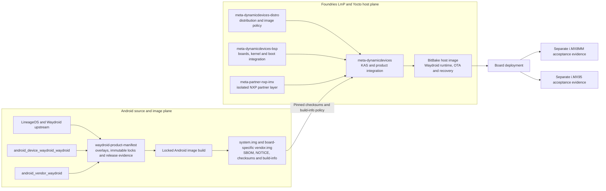

# AESL Waydroid product manifests

This repository owns the reviewed, immutable source manifests used to build
Active ESL Waydroid product images.

[](https://github.com/active-esl/waydroid-product-manifest/actions/workflows/governance.yml)
[](https://github.com/active-esl/waydroid-product-manifest/actions/workflows/build-lineage-23.2-images.yml)
[](https://github.com/active-esl/waydroid-product-manifest/actions/workflows/resolve-lineage-23.2-lock.yml)

## Repository role

This is the **release-orchestration and source-lock repository** for the AESL
Waydroid platform. It owns:

- the complete, commit-pinned Android source graph;
- product build workflows and reproducibility controls;
- the supported-board register and release evidence requirements; and
- SBOM, licence, binary-risk and runtime-acceptance gates.

Related repositories have deliberately narrower responsibilities:

- [`active-esl/android_device_waydroid_waydroid`](https://github.com/active-esl/android_device_waydroid_waydroid)
  defines Waydroid Android products and their shared resource policies;
- [`active-esl/android_vendor_waydroid`](https://github.com/active-esl/android_vendor_waydroid)
  carries the generic Waydroid vendor integration and reviewed compatibility
  patches; and
- NXP kernel, bootloader, firmware and host-container integration remain in the
  separately controlled Dynamic Devices BSP and Yocto repositories.

## Repository and layer architecture



The manifest repository controls the Android source graph and image evidence;
it does not replace the host layers. At the integration boundary,
[`DynamicDevices/meta-dynamicdevices`](https://github.com/DynamicDevices/meta-dynamicdevices)
combines the
[`meta-dynamicdevices-distro`](https://github.com/DynamicDevices/meta-dynamicdevices-distro),
[`meta-dynamicdevices-bsp`](https://github.com/DynamicDevices/meta-dynamicdevices-bsp)
and isolated
[`active-esl/meta-partner-nxp-imx`](https://github.com/active-esl/meta-partner-nxp-imx)
layers. Android images cross that boundary only as reviewed artefacts with
pinned checksums and recorded build policy. i.MX8MM and i.MX95 then retain
separate vendor-image, hardware and release-acceptance evidence.

Android versions and board profiles are release-line or product identities,
not separate repository identities. The current maintained integration line is
`lineage-23.2-aesl`; targets such as x86_64, i.MX8MM and i.MX95 remain explicit
products beneath that line.

Repository membership, a branch name or a successful CI run does not by itself
create a five-year support commitment or demonstrate CRA conformity. Those
claims attach only to an approved product release with its immutable manifest,
declared support period, delivered-artifact SBOM, binary risk register and
board acceptance evidence.

The maintained product-line architecture, board lifecycle register and CRA
engineering gates are defined in `docs/android-platform-lifecycle.md`,
`config/board-support.json`, `docs/release-governance.md` and
`docs/CRA-COMPLIANCE.md`. A successful image build is not by itself a
supported-board or conformity decision.

## Documentation

- [Android platform lifecycle](docs/android-platform-lifecycle.md) defines the
  maintained release line, product structure and board-support lifecycle.
- [NXP board bring-up](docs/nxp-board-bringup.md) defines the separate i.MX8MM
  and i.MX95 integration and acceptance paths.
- [Release governance](docs/release-governance.md) defines release authority,
  immutable evidence and support commitments.
- [CRA compliance](docs/CRA-COMPLIANCE.md) maps engineering evidence to the
  Cyber Resilience Act controls used by this repository.
- [Contributing](CONTRIBUTING.md) and [Security](SECURITY.md) define change and
  vulnerability-reporting policy.

## Android 16 baseline

- Android: 16 QPR2
- LineageOS: 23.2
- Waydroid upstream mirror: `waydroid/dev/lineage-23.2`
- AESL integration branch: `active-esl/lineage-23.2-aesl`
- Initial vendor commit: `d39b2f967d7e54642d674030b1bc1310cdb7b93b`
- Product variants: Vanilla x86_64 validation, then Vanilla ARM64

The files under `overlays/lineage-23.2` are bootstrap inputs only. Branch
names are permitted there because the resolver converts the complete checkout
into a flattened manifest containing commit hashes. Product image builds must
consume a reviewed file under `locks/`; they must never build from the
bootstrap overlays.

## Resolve a candidate lock

Run the **Resolve Android 16 source lock** workflow. It synchronises the
LineageOS and Waydroid source graph, writes `lineage-23.2-lock.xml`, and rejects
the result unless every project revision is a full Git commit hash.

Review the workflow artifact before committing it to
`locks/lineage-23.2-lock.xml`. Updating that file is a controlled source-base
change and should be performed independently of an image release.

The **Build locked Android 16 images** workflow refuses to build without that
reviewed lock. It builds the x86_64 compatibility target first and the AESL
i.MX8MM ARM64-only target second, generates an SPDX SBOM for each, and records
the system and vendor NOTICE licence archives, checksums and immutable build
metadata with the images. Development
`userdebug` output is evidence for integration only; a production release must
also pass the `user` target and the board acceptance procedure.
Select the `user` i.MX8MM variant when manually dispatching the image workflow;
that path invokes the blocking runtime-SELinux exception decision as well as
the normal neverallow build checks. The default `userdebug` path inventories
the exception but cannot produce production-approved release evidence.
`build-info.json` records the selected i.MX8MM variant, release class and
SELinux gate mode so the Yocto host build can reject an integration artifact
when producing a production image.

After the x86_64 lane has already passed, select the `imx8mm` build scope to
resume a failed board-image build without repeating the compatibility lane.
The normal release-validation scope remains `all`.

## Framework x86_64 smoke test

Extract the completed workflow's `x86_64/system.img` and `vendor.img` into a
versioned local directory, then point `/etc/waydroid-extra/images` at that
directory. Waydroid 1.6.x discovers custom preinstalled images at this fixed
path; do not pass the local directory to `waydroid init -i`, because `-i`
selects an OTA channel rather than an image path.

After starting the container and user session, run:

```sh
./scripts/framework-x86-runtime-check.sh
```

Android 16 changed both the service-manager wire protocol and Waydroid's
platform interface descriptor. Waydroid 1.6.2 and libgbinder 1.1.43 cannot
open the UI directly. Prepare the reviewed project-local host runtime once,
then use its compatibility launcher for the session and UI:

```sh
./scripts/prepare-waydroid-a16-host.sh
systemd-run --user --collect "$PWD/scripts/waydroid-a16-host" session start
./scripts/waydroid-a16-host show-full-ui
```

The preparation script pins libgbinder 1.1.52 and libglibutil 1.0.82 by exact
commit, installs nothing system-wide, and requires no elevated privileges.

The check records image hashes and compact host/Android diagnostics, requires
Android 16 to finish boot, verifies the AIDL graphics allocator and
SurfaceFlinger GLES state, and rejects common software-rendering fallbacks.
Its timestamped evidence directory is ignored by Git.

For host-side validation of the shared i.MX8MM 2 GB Android policy, dispatch
the `x86_64_2gb` build scope. It emits the native x86_64 product
`lineage_waydroid_aesl_2gb_x86_64-userdebug` in a separate persistent output
tree. Run it with a 2 GiB container cgroup limit; this validates low-memory
behaviour on the Framework but does not replace i.MX8MM board acceptance.

The first proven image/host combination is recorded immutably in
`locks/framework-x86-runtime-2026-09-11.json`. NXP deployment must follow
`docs/nxp-board-bringup.md`; in particular, i.MX8MM and i.MX95 have separate
vendor-image and hardware-acceleration acceptance gates.

Google applications, Widevine, native-translation prebuilts, Android TV
Settings and optional Redroid prebuilts are excluded from the AESL Vanilla
source graph. Licence verification remains a release gate before the first
production image.

## CI workflows

**Repository governance** runs for pull requests and pushes to `main`. It
checks shell and Python syntax, immutable source-lock validation and the
supported-board register. The image workflow separately regression-tests its
CI resource policy before starting a build.

**Resolve Android 16 source lock** and **Build locked Android 16 images** are
manually dispatched because they operate the controlled release process and
use the dedicated Android build runner. The image workflow supports `all`,
`x86_64`, `x86_64_2gb` and `imx8mm` scopes. Its 24-hour timeout accommodates a
cold target-specific output tree; subsequent runs reuse the persistent
incremental state under `/yocto`.

The badges report the latest workflow result on `main`. A green image-build
badge proves only the inputs and scope recorded by that run. It does not by
itself approve a release, establish board support or demonstrate CRA
conformity.

## CI storage invariant

On the AESL self-hosted runner, all persistent Android and Yocto source trees,
downloads, caches and build outputs must live on the large `/yocto` volume.
Never place them under `/opt/actions-runner/_work` or the runner root volume;
that filesystem is reserved for the small job checkout, diagnostics and logs.
Workflows must preflight `/yocto` capacity before starting a source sync or
build.

The image workflow preserves incremental state deliberately: a repeated lock
skips `repo sync`, a changed lock synchronizes only changed projects, and each
patched project is restored only when its locked revision or ordered patch
series changes. The existing x86_64 cache remains in `out`; i.MX8MM uses the
separate persistent `out-imx8mm` tree so switching architectures cannot evict
the other target's intermediates. `lineage-23.2-source-date-epoch` is fixed for
the release line to prevent lock bookkeeping changes from invalidating Soong.
