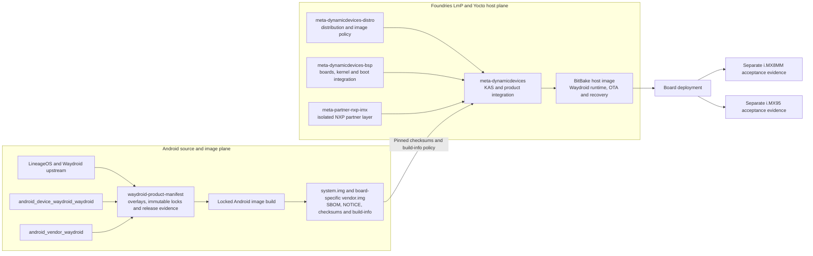

# AESL Waydroid product manifests

This repository owns the reviewed, immutable source manifests used to build
Active ESL Waydroid product images.

[](https://github.com/active-esl/waydroid-product-manifest/actions/workflows/governance.yml)
[](https://github.com/active-esl/android_vendor_waydroid/actions/workflows/build-images.yml?query=branch%3Alineage-20)
[](https://github.com/active-esl/waydroid-product-manifest/actions/workflows/build-lineage-23.2-images.yml)
[](https://github.com/active-esl/waydroid-product-manifest/actions/workflows/resolve-lineage-23.2-lock.yml)

## Start here

This is the front door for the AESL Waydroid platform. Choose the path that
matches what you are trying to do:

| Goal | Start with |
| --- | --- |
| Understand the platform and current evidence | [Repository role](#repository-role), then the [build and board-test matrix](#build-and-board-test-status) |
| Validate a proposed change | [Getting started](docs/getting-started.md#validate-the-repository) and [Contributing](CONTRIBUTING.md) |
| Build an Android R16 image | [Getting started](docs/getting-started.md#build-android-r16--lineageos-232) |
| Work with the legacy R13 lane | [Getting started](docs/getting-started.md#legacy-android-r13--lineageos-20) |
| Integrate or test an NXP board | [NXP board bring-up](docs/nxp-board-bringup.md) |
| Prepare a supported release | [Release governance](docs/release-governance.md) and [CRA readiness](docs/CRA-COMPLIANCE.md) |

The normal entry point is the GitHub Actions build, not a direct invocation of
the build script on a laptop. Android builds require the AESL self-hosted
runner, a large persistent `/yocto` volume and the reviewed immutable source
lock. Anyone can inspect and validate the repository locally; dispatching its
image workflows requires repository access and the configured runner.

## Repository role

This is the **release-orchestration and source-lock repository** for the AESL
Waydroid platform. It owns:

- the complete, commit-pinned Android source graph;
- product build workflows and reproducibility controls;
- the supported-board register and release evidence requirements; and
- SBOM, licence, binary-risk and runtime-acceptance gates.

Related repositories have deliberately narrower responsibilities:

- [`active-esl/android_device_waydroid_waydroid`](https://github.com/active-esl/android_device_waydroid_waydroid)
  defines Waydroid Android products and their shared resource policies;
- [`active-esl/android_vendor_waydroid`](https://github.com/active-esl/android_vendor_waydroid)
  carries the generic Waydroid vendor integration and reviewed compatibility
  patches; and
- NXP kernel, bootloader, firmware and host-container integration remain in the
  separately controlled Dynamic Devices BSP and Yocto repositories.

## Repository and layer architecture



The manifest repository controls the Android source graph and image evidence;
it does not replace the host layers. At the integration boundary,
[`DynamicDevices/meta-dynamicdevices`](https://github.com/DynamicDevices/meta-dynamicdevices)
combines the
[`meta-dynamicdevices-distro`](https://github.com/DynamicDevices/meta-dynamicdevices-distro),
[`meta-dynamicdevices-bsp`](https://github.com/DynamicDevices/meta-dynamicdevices-bsp)
and isolated
[`active-esl/meta-partner-nxp-imx`](https://github.com/active-esl/meta-partner-nxp-imx)
layers. Android images cross that boundary only as reviewed artefacts with
pinned checksums and recorded build policy. i.MX8MM and i.MX95 then retain
separate vendor-image, hardware and release-acceptance evidence.

Android versions and board profiles are release-line or product identities,
not separate repository identities. This repository orchestrates R16 from
`main`; the device and vendor components use their `lineage-23.2-aesl`
integration branches before their exact commits are frozen in the reviewed
lock. Targets such as x86_64, i.MX8MM and i.MX95 remain explicit products
beneath that line.

Repository membership, a branch name or a successful CI run does not by itself
create a five-year support commitment or demonstrate CRA conformity. Those
claims attach only to an approved product release with its immutable manifest,
declared support period, delivered-artifact SBOM, binary risk register and
board acceptance evidence.

The maintained product-line architecture, board lifecycle register and CRA
engineering gates are defined in `docs/android-platform-lifecycle.md`,
`config/board-support.json`, `docs/release-governance.md` and
`docs/CRA-COMPLIANCE.md`. A successful image build is not by itself a
supported-board or conformity decision.

## Documentation

- [Getting started](docs/getting-started.md) gives the shortest route to local
  validation, CI image builds, artifacts and board integration.
- [Android platform lifecycle](docs/android-platform-lifecycle.md) defines the
  maintained release line, product structure and board-support lifecycle.
- [NXP board bring-up](docs/nxp-board-bringup.md) defines the separate i.MX8MM
  and i.MX95 integration and acceptance paths.
- [Release governance](docs/release-governance.md) defines release authority,
  immutable evidence and support commitments.
- [CRA compliance](docs/CRA-COMPLIANCE.md) maps engineering evidence to the
  Cyber Resilience Act controls used by this repository.
- [Contributing](CONTRIBUTING.md) and [Security](SECURITY.md) define change and
  vulnerability-reporting policy.

## Android 16 baseline

- Android: 16 QPR2
- LineageOS: 23.2
- Waydroid upstream mirror: `waydroid/dev/lineage-23.2`
- Orchestration branch: this repository's `main`
- AESL component branches: `lineage-23.2-aesl`
- Authoritative build input: [`locks/lineage-23.2-lock.xml`](locks/lineage-23.2-lock.xml)
- Product profiles: Vanilla x86_64 validation plus standard and 2 GB ARM64

## Maintained release and memory profiles

AESL targets Android R16 / LineageOS 23.2 as the maintainable baseline for new
CRA-oriented product work over a declared support period of at least five
years. This is an engineering support objective, not a claim that a build or
product is CRA compliant. Android R13 / LineageOS 20 remains available in the
legacy `android_vendor_waydroid` pipeline for potential customers with an
existing compatibility or qualification requirement.

The maintained ARM64 CI matrix is explicit:

| Release | Profile | Build scope | Android product | Maintenance intent |
| --- | --- | --- | --- | --- |
| R13 / LineageOS 20 | `standard` | R13 `memory_profile=standard` | `lineage_waydroid_arm64` | Legacy customer qualification |
| R13 / LineageOS 20 | `2gb` | Pending promotion to the R13 workflow | `lineage_waydroid_aesl_2gb_arm64_only` | Legacy constrained products |
| R16 / LineageOS 23.2 | `standard` | `arm64_standard` | `lineage_waydroid_arm64_only` | Preferred maintained baseline |
| R16 / LineageOS 23.2 | `2gb` | `arm64_2gb` | `lineage_waydroid_aesl_2gb_arm64_only` | Preferred constrained baseline |

### Build and board-test status

This is the current evidence matrix, modelled on the build-status table used by
`DynamicDevices/meta-mono`. It deliberately separates an image build from a
successful board boot: **PASS** means that the linked evidence completed for
that column, **FAIL** means that the linked test exposed a reproducible
blocker, and **NOT RUN** means no qualifying result has been recorded yet.

| Release | Profile | Image build | Jaguar Screen i.MX8MM boot | FRDM i.MX95 boot | Release intent |
| --- | --- | --- | --- | --- | --- |
| R13 / LineageOS 20 | `standard` | **PASS** ([run 34838947265](https://github.com/active-esl/android_vendor_waydroid/actions/runs/34838947265)) | **PASS** (Foundries target 2887: Android UI and Etnaviv acceleration at 1920x1200) | **NOT RUN** | Legacy customer qualification |
| R13 / LineageOS 20 | `2gb` | **NOT RUN** | **NOT RUN** | **NOT RUN** | Legacy constrained products |
| R16 / LineageOS 23.2 | `standard` | **NOT RUN** | **NOT RUN** | **NOT RUN** | Preferred maintained baseline |
| R16 / LineageOS 23.2 | `2gb` | **PASS** ([run 34856380503](https://github.com/active-esl/waydroid-product-manifest/actions/runs/34856380503)) | **FAIL** (2026-09-14: target 2892 has Waydroid 1.4.2/libgbinder 1.1.35 and never exposes the Android 16 platform service; requires a complete 1.6.3/AIDL6 host build with image-APEX device mounts) | **FAIL** (2026-09-14: the i.MX8MM vendor image reaches Android 16 userspace after the image-APEX host fix, but cannot create an EGL configuration on the i.MX95 DPU-only DRM node) | Preferred constrained baseline |

The status date is **2026-09-14**. Update a cell only from immutable CI or
board-test evidence and link that evidence in the cell. A green image workflow
does not imply a green host build, Android boot, hardware-acceleration test,
OTA test, production release, or CRA conformity decision. R16 no longer
supports the legacy flattened-APEX build mode, so its host acceptance path must
provide narrowly scoped loop and device-mapper support rather than claiming
that `OVERRIDE_TARGET_FLATTEN_APEX` changed the image format.

The active Jaguar integration tuple is
`imx8mm-jaguar-screen-r16-waydroid-2gb-userdebug`, built on the isolated
Foundries branch `r16-jaguar-screen` and reported as
`platform-r16-jaguar-screen`. It is intentionally not a generic Jaguar host
build and does not carry the production `main-jaguar-screen` OTA tag. No
Foundries build becomes a PASS until it publishes a target and the paired host
and Android artifacts pass the physical-board checks. The dated build-attempt,
checksum and rollback evidence is retained in
[NXP board bring-up](docs/nxp-board-bringup.md#jaguar-screen-evidence-log).

Each scope has an independent Soong output cache and emits paired images,
immutable source provenance, artifact-derived SPDX, NOTICE archives, build
metadata and complete checksums. Hardware support and a commercial support
period still attach to an accepted whole-product release, not to this matrix.

The files under `overlays/lineage-23.2` are bootstrap inputs only. Branch
names are permitted there because the resolver converts the complete checkout
into a flattened manifest containing commit hashes. Product image builds must
consume a reviewed file under `locks/`; they must never build from the
bootstrap overlays.

## Resolve a candidate lock

Run the **Resolve Android R16 / LineageOS 23.2 source lock** workflow. It synchronises the
LineageOS and Waydroid source graph, writes `lineage-23.2-lock.xml`, and rejects
the result unless every project revision is a full Git commit hash.

Review the workflow artifact before committing it to
`locks/lineage-23.2-lock.xml`. Updating that file is a controlled source-base
change and should be performed independently of an image release.

The **Build Android R16 / LineageOS 23.2 images** workflow refuses to build without that
reviewed lock. Its `all` scope builds the x86_64 compatibility target plus the
standard and 2 GB ARM64 targets, generates an SPDX SBOM for each, and records
the system and vendor NOTICE licence archives, checksums and immutable build
metadata with the images. Development
`userdebug` output is evidence for integration only; a production release must
also pass the `user` target and the board acceptance procedure.
Select the `user` ARM64 variant when manually dispatching the image workflow;
that path invokes the blocking runtime-SELinux exception decision as well as
the normal neverallow build checks. The default `userdebug` path inventories
the exception but cannot produce production-approved release evidence.
`build-info.json` records the selected ARM64 variant, memory profile, release class and
SELinux gate mode so the Yocto host build can reject an integration artifact
when producing a production image.

After the x86_64 lane has already passed, select `arm64_standard` or
`arm64_2gb` to rebuild only the required maintained profile without repeating
the compatibility lane.
The normal release-validation scope remains `all`.

## Framework x86_64 smoke test

Extract the completed workflow's `x86_64/system.img` and `vendor.img` into a
versioned local directory, then point `/etc/waydroid-extra/images` at that
directory. Waydroid 1.6.x discovers custom preinstalled images at this fixed
path; do not pass the local directory to `waydroid init -i`, because `-i`
selects an OTA channel rather than an image path.

After starting the container and user session, run:

```sh
./scripts/framework-x86-runtime-check.sh
```

Android 16 changed both the service-manager wire protocol and Waydroid's
platform interface descriptor. Waydroid 1.6.2 and libgbinder 1.1.43 cannot
open the UI directly. Prepare the reviewed project-local host runtime once,
then use its compatibility launcher for the session and UI:

```sh
./scripts/prepare-waydroid-a16-host.sh
systemd-run --user --collect "$PWD/scripts/waydroid-a16-host" session start
./scripts/waydroid-a16-host show-full-ui
```

The preparation script pins libgbinder 1.1.52 and libglibutil 1.0.82 by exact
commit, installs nothing system-wide, and requires no elevated privileges.

The check records image hashes and compact host/Android diagnostics, requires
Android 16 to finish boot, verifies the AIDL graphics allocator and
SurfaceFlinger GLES state, and rejects common software-rendering fallbacks.
Its timestamped evidence directory is ignored by Git.

For host-side validation of the shared i.MX8MM 2 GB Android policy, dispatch
the `x86_64_2gb` build scope. It emits the native x86_64 product
`lineage_waydroid_aesl_2gb_x86_64-userdebug` in a separate persistent output
tree. Run it with a 2 GiB container cgroup limit; this validates low-memory
behaviour on the Framework but does not replace i.MX8MM board acceptance.

The first proven image/host combination is recorded immutably in
`locks/framework-x86-runtime-2026-09-11.json`. NXP deployment must follow
`docs/nxp-board-bringup.md`; in particular, i.MX8MM and i.MX95 have separate
vendor-image and hardware-acceleration acceptance gates.

Google applications, Widevine, native-translation prebuilts, Android TV
Settings and optional Redroid prebuilts are excluded from the AESL Vanilla
source graph. Licence verification remains a release gate before the first
production image.

## CI workflows

**Repository governance** runs for pull requests and pushes to `main`. It
checks shell and Python syntax, immutable source-lock validation and the
supported-board register. The image workflow separately regression-tests its
CI resource policy before starting a build.

**Resolve Android R16 / LineageOS 23.2 source lock** and
**Build Android R16 / LineageOS 23.2 images** are
manually dispatched because they operate the controlled release process and
use the dedicated Android build runner. The image workflow supports `all`,
`arm64_standard`, `arm64_2gb`, `x86_64` and `x86_64_2gb` scopes. Its 24-hour timeout accommodates a
cold target-specific output tree; subsequent runs reuse the persistent
incremental state under `/yocto`.

The R16 badges report the latest workflow result on `main`; the R13 badge is
explicitly scoped to `android_vendor_waydroid`'s `lineage-20` branch. A green
image-build badge proves only the inputs and scope recorded by that run. It
does not by itself approve a release, establish board support or demonstrate
CRA conformity.

## CI storage invariant

On the AESL self-hosted runner, all persistent Android and Yocto source trees,
downloads, caches and build outputs must live on the large `/yocto` volume.
Never place them under `/opt/actions-runner/_work` or the runner root volume;
that filesystem is reserved for the small job checkout, diagnostics and logs.
Workflows must preflight `/yocto` capacity before starting a source sync or
build.

The image workflow preserves incremental state deliberately: a repeated lock
skips `repo sync`, a changed lock synchronizes only changed projects, and each
patched project is restored only when its locked revision or ordered patch
series changes. The x86_64, x86_64 2 GB, ARM64 standard and ARM64 2 GB lanes
use separate persistent output trees so switching targets cannot evict one
another's intermediates. `lineage-23.2-source-date-epoch` is fixed for the
release line to prevent lock bookkeeping changes from invalidating Soong.
